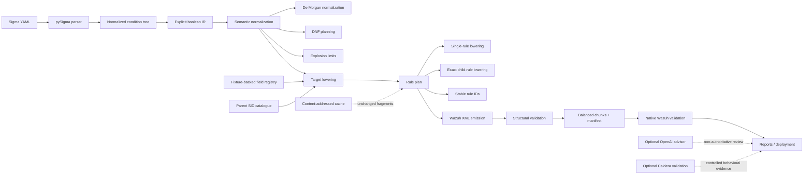

<div align="center">

# WAZUH SIGMA PIPELINE

### A fail-closed detection compiler for Sigma → Wazuh

**Parse the rule. Preserve the logic. Prove the output. Reject the rest.**

[](https://github.com/ahkecha/wazuh-sigma-pipeline/actions/workflows/ci.yml)
[](https://www.python.org/)
[](evidence/native-validation-baseline.json)
[](evidence/corpus-baseline.json)
[](evidence/corpus-baseline.json)
[](docs/SUPPORT_MATRIX.md)
[](LICENSE.md)

[Why it exists](#why-this-exists) · [Evidence](#evidence-not-marketing) · [Architecture](#compiler-architecture) · [Quick start](#quick-start) · [Semantics](#semantic-lowering) · [Validation](#validation-ladder) · [Documentation](#documentation)

</div>

---

> [!IMPORTANT]
> **This project does not ask whether Sigma YAML can be turned into XML. It asks whether the detection can survive the translation without becoming a different detection.** If the answer cannot be proven, compilation fails.

## Evidence, not marketing

The current committed Windows baseline is measured against **2,403 SigmaHQ rules** in strict mode.

| Measurement | Current baseline |
|---|---:|
| Sigma rules evaluated | **2,403** |
| Semantically safe compilations | **1,925** |
| Explicitly rejected rules | **478** |
| Strict conversion coverage | **80.11%** |
| Generated Wazuh XML rules | **10,701** |
| Balanced output chunks | **4** |
| XML validation failures | **0** |
| Chunk validation failures | **0** |
| Native `wazuh-analysisd -t` | **Passed** |
| Tested Wazuh version | **4.14.6** |

The baseline is reproducible and committed:

- [`evidence/corpus-baseline.json`](evidence/corpus-baseline.json)
- [`evidence/semantic-baseline.json`](evidence/semantic-baseline.json)
- [`evidence/native-validation-baseline.json`](evidence/native-validation-baseline.json)

> [!NOTE]
> Native parser success proves that Wazuh accepts the generated rules. It does **not** by itself prove end-to-end event-to-alert behavior. Behavioral replay remains a separate validation layer.

---

## Why this exists

Sigma and Wazuh do not share the same execution model.

Sigma has selections, modifiers, grouped boolean conditions, wildcard selectors, negation and abstract fields. Wazuh has XML rules, decoder-specific field names, parent SID relationships, PCRE2 constraints and target-version behavior.

A naive converter can produce XML that looks legitimate while silently changing:

- `AND` into `OR`;
- grouped logic into flattened predicates;
- exclusions into ignored filters;
- field semantics into guessed names;
- one Sigma detection into an overbroad Wazuh alert.

**Wazuh Sigma Pipeline is built to prevent that class of failure.**

### Converter versus compiler

| Basic converter | This project |
|---|---|
| Rewrites syntax | Preserves a semantic model |
| Flattens conditions | Builds an explicit boolean IR |
| Guesses target fields | Uses versioned, fixture-backed mappings |
| Emits one plausible rule | Plans exact parent/child rule structures |
| Treats regex compilation as success | Validates XML and the native Wazuh parser |
| Hides unsupported rules | Rejects them with deterministic diagnostics |
| Optimizes for a high percentage | Optimizes for defensible detections |

---

## Compiler architecture



### The compilation pipeline

```text
Sigma source
   │
   ├─ parse and normalize with pySigma
   ├─ build boolean IR
   ├─ preserve AND / OR / NOT / grouping / selectors
   ├─ normalize grouped NOT with exact De Morgan transformations
   ├─ lower representable branches to Wazuh predicates
   ├─ generate deterministic child rules when one rule is insufficient
   ├─ resolve fixture-backed Wazuh fields and parent SIDs
   ├─ emit deterministic XML, chunks and reports
   └─ validate against Wazuh itself
```

---

## The trust contract

The compiler follows five non-negotiable rules:

1. **Never flatten boolean logic.** A syntactically valid rule with different semantics is a failed compilation.
2. **Never invent Windows fields.** Strict mode requires a verified mapping or rejects the rule.
3. **Never hide unsupported behavior.** Every rejection is classified and reported.
4. **Never confuse parser acceptance with detection correctness.** Native loading and behavioral triggering are separate gates.
5. **Never let optional systems become authoritative.** AI and Caldera integrations cannot replace deterministic compilation and Wazuh evidence.

---

## Semantic lowering

The backend consumes pySigma's parsed condition tree and lowers it through an explicit IR.

| Sigma construct | Strict lowering strategy |
|---|---|
| AND across distinct fields | Multiple Wazuh field predicates |
| AND on the same field | Independent PCRE2 lookaheads when provably safe |
| OR on the same field | PCRE2 alternation |
| OR across distinct field sets | Deterministic child-rule branches |
| Grouped / nested conditions | Exact normalization and branch planning |
| Single and grouped NOT | Predicate negation plus exact De Morgan normalization |
| `1 of` / `all of` selectors | Resolved by pySigma before IR lowering |
| IPv4 CIDR | Bounded dotted-quad PCRE2 |
| Oversized same-field OR | Semantics-preserving child-rule splitting |
| Unrepresentable expressions | Explicit fail-closed rejection |

### Example: why child rules matter

A condition such as:

```text
(process_image AND suspicious_argument)
OR
(parent_image AND network_destination)
```

cannot be flattened into four fields in one Wazuh rule. That would require all four predicates and change `OR` into `AND`.

The compiler instead plans separate branches and emits the Wazuh rule structure required to preserve the original expression.

### Explosion control

Correct DNF expansion can still be operationally dangerous. The compiler enforces deterministic limits on:

- DNF alternatives;
- predicates per alternative;
- generated child rules;
- recursion depth;
- PCRE2 pattern size;
- total rule-plan size.

Exceeding a limit rejects the entire Sigma rule. The compiler never emits a partial interpretation.

---

## The coverage journey

The project deliberately moved backward before moving forward.

| Milestone | Strict coverage | What changed |
|---|---:|---|
| Permissive baseline | **88.10%** | High output, but semantic auditing exposed unsafe lowering |
| Boolean IR baseline | **41.91%** | Failed closed on every unproven condition shape |
| Exact child-rule lowering | **66.50%** | Recovered distinct-field OR without flattening logic |
| Grouped NOT + IPv4 CIDR | **79.15%** | Added De Morgan normalization and bounded CIDR lowering |
| Fixture mappings + safe OR splitting | **80.11%** | Recovered verified mappings and oversized alternations |

The 41.91% result was not a regression. It was the point where the reported number became trustworthy.

---

## Current strict rejection surface

The remaining 478 Windows rules are rejected intentionally.

| Rejection category | Rules |
|---|---:|
| Unsupported Windows field without fixture-backed mapping | **216** |
| DNF alternatives exceed configured limit | **103** |
| Generated child rules exceed configured limit | **58** |
| Null / existence checks not proven | **58** |
| IPv6 CIDR canonicalization not proven | **16** |
| `base64offset` | **7** |
| Fieldless value expressions | **7** |
| Predicates per DNF alternative exceed limit | **6** |
| `all` without a safely supported combination | **5** |
| `fieldref` | **1** |
| `ignorecase` | **1** |

This is a feature, not hidden technical debt: unsupported semantics stay visible instead of becoming weak detections.

---

## Quick start

Requires **Python 3.10–3.12**.

```bash
git clone https://github.com/ahkecha/wazuh-sigma-pipeline.git
cd wazuh-sigma-pipeline

python -m venv .venv
source .venv/bin/activate

python -m pip install --upgrade pip
python -m pip install -e ".[test]"

python -m pytest
```

### Compile and validate the example corpus

```bash
sigma-convert \
  --directory examples/sigma \
  --output build/sigmahq/sigma_rules.xml \
  --report build/conversion-report.json

sigma-validate \
  --rules build/sigmahq/sigma_rules.xml \
  --output text

sigma-validate \
  --rules build/sigmahq/chunks \
  --output text
```

The converter emits:

```text
build/sigmahq/
├── sigma_rules.xml
└── chunks/
    ├── sigma_rules_001.xml
    ├── sigma_rules_002.xml
    ├── ...
    └── manifest.json
```

Installed commands:

```text
sigma-convert
sigma-validate
sigma-deploy-wazuh
sigma-pipeline
sigma-windows-analysis
```

On PowerShell:

```powershell
.\.venv\Scripts\Activate.ps1
```

---

## Operate the pipeline

The config-driven CLI exposes the lifecycle as explicit gates:

```bash
sigma-pipeline doctor   --config pipeline.yml
sigma-pipeline convert  --config pipeline.yml
sigma-pipeline validate --config pipeline.yml
sigma-pipeline smoke    --config pipeline.yml
```

| Command | Responsibility |
|---|---|
| `doctor` | Validate configuration, paths, credentials, mappings and readiness blockers |
| `convert` | Parse, lower and emit managed Wazuh artifacts |
| `validate` | Validate existing XML or chunk directories |
| `smoke` | Run conversion and validation as one local release gate |
| `deploy` | Validate, back up, upload, restart, verify and roll back |
| `advise` | Generate optional non-authoritative quality findings |
| `active-test` | Run controlled Caldera stimuli and query Wazuh evidence |

Relative paths are resolved from the configuration file directory. Unknown configuration keys fail validation rather than being silently ignored.

### Minimal configuration

```yaml
sigma_dir: examples/sigma
output_file: build/sigmahq/sigma_rules.xml
conversion_report: build/conversion-report.json
validation_report: build/validation-report.json
strict_validation: true

wazuh:
  rule_id_start: 900000
  rule_id_end: 949999
  windows_field_mapping_mode: strict
  host: https://wazuh.example.com:55000
  remote_file: sigma_rules.xml
  insecure: false
  ca_bundle: /etc/ssl/certs/internal-ca.pem

incremental_cache:
  enabled: false
  directory: build/conversion-cache
  manifest: build/conversion-cache/manifest.json
  strict: false

advisor:
  enabled: false
  mode: report-only
```

Credentials and API keys belong in environment variables—not in `pipeline.yml`.

---

## Fixture-backed Windows mapping

Windows EventChannel field names are decoder outputs, not guesses.

```text
Sigma field
   │
   ├─ logsource product / service / category
   ├─ event provider and channel context
   ├─ decoded Wazuh fixture evidence
   └─ mapping registry version
   ▼
win.system.* or win.eventdata.*
```

Strict mode rejects an unknown field rather than transforming it into a plausible lowercase name.

```yaml
wazuh:
  windows_field_mapping_mode: strict
```

The latest recovery added only scoped, fixture-backed mappings for:

```text
Action              AppName
ApplicationPath     ExceptionCode
ModifyingApplication NewValue
Service             Workstation
```

Read the evidence model in:

- [Windows EVTX field mapping](docs/windows-evtx-field-mapping.md)
- [Wazuh parent SID mapping](docs/wazuh-parent-rule-mapping.md)

---

## Validation ladder

A generated rule passes through progressively stronger gates:

```text
1. Sigma parsing
2. Semantic IR construction
3. Fail-closed lowering checks
4. PCRE2 construction and limits
5. XML structural validation
6. Rule ID and parent SID validation
7. Balanced chunk validation
8. Native wazuh-analysisd -t
9. Behavioral event-to-alert validation
```

The committed baseline has passed layers 1–8 for the current generated corpus. Layer 9 remains an independent operational proof requirement.

### Native Wazuh validation

```bash
python -m pip install -e ".[test]"

docker compose up -d
docker cp wazuh-rule-test:/var/ossec/ruleset/rules build/wazuh-builtin-rules

python scripts/normalize_wazuh_rules.py build/sigmahq \
  --target-rules-dir build/wazuh-builtin-rules

docker compose up -d --force-recreate

docker compose exec -T wazuh.manager \
  /var/ossec/bin/wazuh-analysisd -t
```

A successful native parser run must exit `0` without parser errors.

---

## Safe deployment

```bash
sigma-pipeline deploy \
  --config pipeline.yml \
  --preflight-smoke \
  --backup-remote \
  --rollback-on-failure \
  --restart
```

Deployment protections include:

- local validation before authentication;
- TLS verification and optional custom CA bundles;
- managed remote filenames;
- remote backups;
- restart verification;
- rule visibility checks;
- rollback on failure;
- collision checks against existing Wazuh rule IDs.

`--insecure` is for isolated development environments only.

---

## Deterministic incremental builds

Large corpora can reuse unchanged compiled fragments while preserving stable Wazuh IDs.

```yaml
incremental_cache:
  enabled: true
  directory: build/conversion-cache
  manifest: build/conversion-cache/manifest.json
  strict: false
```

The cache is an optimization, never a trust boundary. The complete ruleset is always reassembled and validated before publication or deployment.

See [Incremental cache design](docs/INCREMENTAL_CACHE.md).

---

## Optional systems, deliberately outside the trust core

### OpenAI advisor

The advisor can review severity and detection quality, but it has no authority to bypass compiler or validation failures.

```bash
python -m pip install -e ".[advisor]"
export OPENAI_API_KEY="..."
sigma-pipeline advise --config pipeline.yml
```

Controls include structured responses, sanitization, bounded retries, deterministic acceptance policy, report-only defaults and content-addressed caching.

See [Advisor documentation](docs/ADVISOR.md).

### Caldera active validation

The active-testing workflow can deploy controlled stimuli in a lab and verify Wazuh evidence.

```bash
sigma-pipeline active-test \
  --config pipeline.yml \
  --preflight-smoke \
  --deploy \
  --restart
```

Caldera executes commands on enrolled agents. This workflow belongs in an isolated test environment and is intentionally excluded from ordinary CI.

---

## Repository map

```text
src/wazuh_sigma/
├── backend/          boolean IR, semantic lowering and XML emission
├── converter/        Sigma loading, normalization, reporting and CLI
├── fields/           fixture-backed field registry
├── validator/        structural and native validation helpers
├── incremental/      stable IDs and content-addressed fragment reuse
├── deploy/           Wazuh API deployment, backup and rollback
├── advisor/          optional OpenAI review layer
├── active_testing/   optional Caldera-backed behavioral validation
├── config.py         strict pipeline configuration
├── naming.py         canonical Sigma/Wazuh naming
└── pipeline.py       lifecycle orchestration

evidence/             committed reproducibility baselines
examples/sigma/       small runnable Sigma corpus
tests/                maintained unit and integration tests
docs/                 design, operations and support documentation
scripts/              normalization and operational utilities
build/                generated artifacts; ignored by Git
```

---

## Documentation

| Document | Purpose |
|---|---|
| [Architecture](docs/ARCHITECTURE.md) | Components, boundaries, trust model and runtime flow |
| [Pipeline](docs/PIPELINE.md) | Stages, reports, CI contract and extension points |
| [Runbook](docs/RUNBOOK.md) | Operation, recovery, rollback and troubleshooting |
| [Project structure](docs/PROJECT_STRUCTURE.md) | Module ownership and repository layout |
| [Conversion coverage](docs/CONVERSION_COVERAGE.md) | Corpus methodology, baselines and release gates |
| [Support matrix](docs/SUPPORT_MATRIX.md) | Supported versions, semantics and readiness boundaries |
| [Windows EVTX mapping](docs/windows-evtx-field-mapping.md) | Mapping evidence and contributor workflow |
| [Parent SID mapping](docs/wazuh-parent-rule-mapping.md) | Parent-rule anchoring and target-version notes |
| [Incremental cache](docs/INCREMENTAL_CACHE.md) | Fingerprints, stable IDs, invalidation and recovery |
| [Advisor](docs/ADVISOR.md) | Provider, policy, sanitization and operating modes |

---

## Known boundaries

The project is **Beta** and does not claim universal Sigma compatibility.

Current boundaries include:

- Windows-first fixture-backed mapping coverage;
- strict rejection of unsupported or unverified fields;
- IPv6 CIDR rejection until decoder text canonicalization is proven;
- unsupported null checks, `base64offset` and `fieldref` semantics;
- intentional DNF and child-rule explosion limits;
- Wazuh-version-specific parent SIDs and decoded field behavior;
- behavioral event-to-alert validation as a separate release gate.

The correct response to an unsupported rule is a precise diagnostic—not a weaker detection.

---

## Contributing

High-value contributions include:

- sanitized Wazuh-decoded event fixtures;
- verified field mappings with provenance;
- Sigma semantic edge cases and differential tests;
- Wazuh-version compatibility evidence;
- safe rule-plan optimizations that reduce child-rule count;
- Linux and macOS telemetry profiles backed by real decoder fixtures;
- behavioral `wazuh-logtest` or equivalent event-to-alert tests.

Every semantic change should include positive, partial and negative cases. Every mapping described as verified should include evidence.

---

## License

The governing repository license is the [PolyForm Noncommercial License 1.0.0](LICENSE.md).

---

<div align="center">

### Detection engineering deserves compiler-grade rigor.

**Reject the fiction. Ship the rule you can prove.**

</div>
